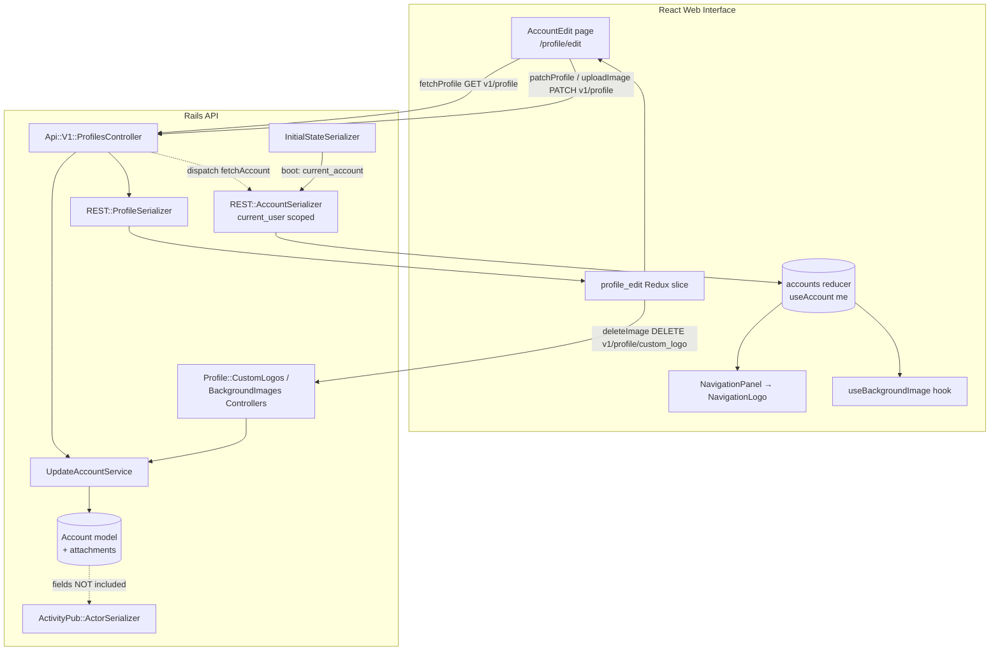
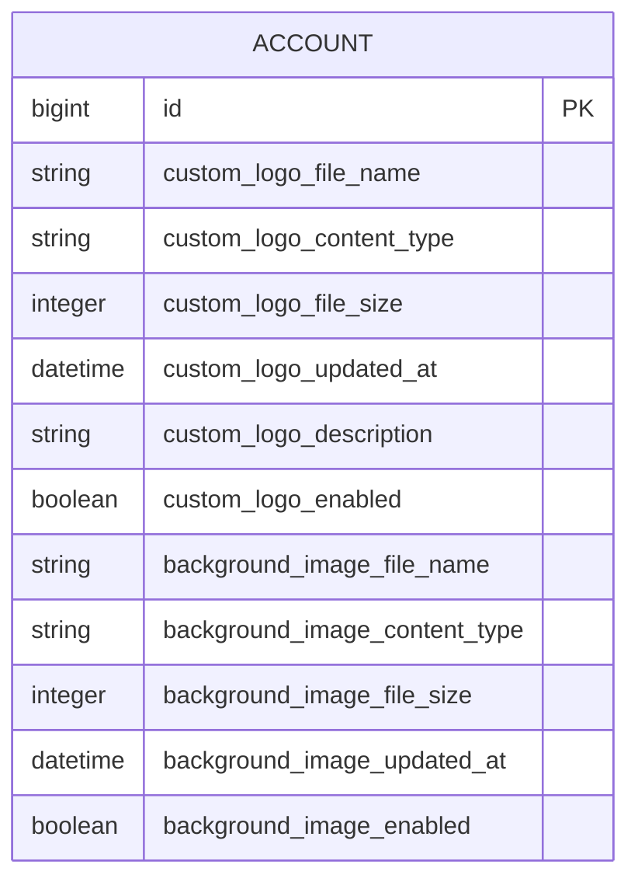

# Design Document

## Overview

This feature adds two **per-user** web-interface customizations to the Mastodon fork, managed from two new sections on the existing React profile edit page (`/profile/edit`, the `AccountEdit` feature):

1. **Custom Logo** — a per-user image that replaces the `WordmarkLogo` inside the navigation panel for the owning user's own session.
2. **Background Image** — a per-user image rendered behind the interface through `body:before` at desktop viewport widths (≥ 890px), with a `brightness(0.15)` darkening filter, fixed positioning, and `top/cover` sizing.

Each customization is fully independent: it owns its own stored image attachment, an optional alt-text/description (logo only), and a boolean enable flag. Each affects **only the owning user's own authenticated session** — the images are never federated through ActivityPub and are never exposed to other users.

The design deliberately mirrors the established `avatar`/`header` machinery already present in the codebase so the new attachments inherit the same validated, metadata-stripped, dimension-limited processing pipeline. The work spans seven layers:

| Layer | Existing pattern reused | New work |
| --- | --- | --- |
| Storage / model | `Account::Avatar`, `Account::Header`, `Attachmentable` | New `Account::CustomLogo` & `Account::BackgroundImage` concerns + DB migration |
| API (update) | `Api::V1::ProfilesController#update` permit list | Add new permitted params |
| API (delete) | `Api::V1::Profile::AvatarsController` / `HeadersController` | New `CustomLogosController` / `BackgroundImagesController` + routes |
| Serialization | `REST::ProfileSerializer`, `REST::AccountSerializer`, `InitialStateSerializer` | New attributes on both serializers, current-user scoped on `AccountSerializer` |
| Federation | `ActivityPub::ActorSerializer` (allow-list) | Verified exclusion (no change required) |
| Client state | `api_types/profile.ts`, `profile_edit` Redux slice | Extend types, `transformProfile`, `selectImageInfo`, `ImageLocation`, delete thunk |
| UI / rendering | `AccountEditSection`, `AccountImageEdit`, `ImageUploadModal`/`ImageDeleteModal`, `ToggleField` | Two new sections, a `NavigationLogo` component, a background-injection hook + SCSS |

### Requirements coverage map

| Requirement | Where addressed |
| --- | --- |
| 1 Custom Logo Storage | Data Models → `Account::CustomLogo`; Migration |
| 2 Custom Logo Validation | Data Models → validations; Error Handling |
| 3 Custom Logo Enable Flag | Data Models → `custom_logo_enabled` column |
| 4 Custom Logo Rendering | Components → `NavigationLogo` |
| 5 Background Image Storage | Data Models → `Account::BackgroundImage`; Migration |
| 6 Background Image Validation | Data Models → validations; Error Handling |
| 7 Background Image Enable Flag | Data Models → `background_image_enabled` column |
| 8 Background Image Rendering | Components → background injection hook + SCSS |
| 9 Profile Edit Page Sections | Components → `AccountEdit` sections |
| 10 Upload/Replace/Remove Flow | Components → modal reuse; API → delete controllers |
| 11 API & Serialization Round-Trip | API + Serialization + Client State |
| 12 Default Behavior & Compatibility | Data Models → defaults; backward compatibility |
| 13 Per-User Scope & Federation Exclusion | Serialization → current-user scope; Federation exclusion |

## Architecture

### High-level data flow



### Key architectural decisions

1. **Two storage targets, two serializers.** The profile editor reads from `REST::ProfileSerializer` (via the `profile_edit` slice), but the **navigation panel and background renderer read `useAccount(me)`** from the global accounts reducer — a different data path. Therefore the new fields must be exposed on **both** `REST::ProfileSerializer` (so the editor can preview/manage them) **and** `REST::AccountSerializer` (so they actually render in the nav panel / at body level). The boot path (`InitialStateSerializer` → `REST::AccountSerializer`) makes them available immediately, and the existing `fetchAccount(response.id)` dispatched by the `patchProfile`/`uploadImage`/`deleteImage` thunks keeps the account entity live-updated after edits.

2. **Privacy via current-user scoping.** `REST::AccountSerializer` is used app-wide (timelines, profiles of *other* users, etc.). To prevent leaking one user's logo/background to others (Requirement 13.1), the new attributes are serialized **only when the serialized account belongs to the requesting user** (`current_user.account_id == object.id`). `InitialStateSerializer` already serializes the current account with `scope_name: :current_user, scope: current_account.user`, and `Api::BaseController` exposes `current_user` as the default serialization scope, so the guard resolves correctly on every path.

3. **Federation exclusion is automatic.** `ActivityPub::ActorSerializer` uses an explicit attribute allow-list (`attributes :id, :webfinger, …`) and only emits `icon`/`image` for avatar/header. Because the new columns are never added to that list, they are inherently excluded from the actor document (Requirement 13.2). The design adds a regression test rather than code.

4. **Reuse the generic image-edit pipeline.** `AccountImageEdit`, `ImageUploadModal`, `ImageDeleteModal`, and `ImageAltModal` are already parameterized over an `ImageLocation`. Extending `ImageLocation` from `'avatar' | 'header'` to also include `'custom_logo' | 'background_image'`, plus a per-location crop-aspect lookup, lets the entire upload→crop→alt→save flow work for the new images with minimal additions.

5. **Background injected via CSS custom property, never inline style.** Rather than injecting an inline `<style>` element containing a server URL (an injection-surface risk), a React hook writes the server-provided asset URL into a CSS custom property on `document.body` (`--custom-background-image`) and toggles a body class (`custom-background`). A static SCSS rule consumes the variable inside the `@media (min-width: 890px)` query. The URL originates from the server's own asset host, but routing it through a CSS variable keeps it out of any HTML/JS parsing context.

## Components and Interfaces

### Server: Model concerns

Two new concerns mirror `Account::Avatar` / `Account::Header`, included in `Account` **after** `Attachmentable` (so the `before_<name>_validate` dimension/metadata hooks are wired):

```ruby
# app/models/account.rb (order matters)
include Attachmentable
include Account::Avatar
include Account::Header
include Account::CustomLogo        # new
include Account::BackgroundImage   # new
```

`Account::CustomLogo` (mirrors Avatar; preserves aspect ratio rather than a square crop):

```ruby
module Account::CustomLogo
  extend ActiveSupport::Concern

  MAX_DESCRIPTION_LENGTH = 150
  CUSTOM_LOGO_IMAGE_MIME_TYPES = ['image/jpeg', 'image/png', 'image/gif', 'image/webp'].freeze
  CUSTOM_LOGO_LIMIT = 8.megabytes
  # Wordmark viewBox is 261x66 (~3.95:1). Bound the longest edge while
  # preserving aspect ratio using the ">" geometry flag (shrink only).
  CUSTOM_LOGO_DIMENSIONS = [522, 132].freeze
  CUSTOM_LOGO_GEOMETRY = [CUSTOM_LOGO_DIMENSIONS.first, CUSTOM_LOGO_DIMENSIONS.last].join('x')

  class_methods do
    def custom_logo_styles(file)
      styles = { original: { geometry: "#{CUSTOM_LOGO_GEOMETRY}>", file_geometry_parser: FastGeometryParser } }
      styles[:static] = { geometry: "#{CUSTOM_LOGO_GEOMETRY}>", format: 'png', convert_options: '-coalesce', file_geometry_parser: FastGeometryParser } if file.content_type == 'image/gif'
      styles
    end

    private :custom_logo_styles
  end

  included do
    has_attached_file :custom_logo, styles: ->(f) { custom_logo_styles(f) }, convert_options: { all: '+profile "!icc,*" +set date:modify +set date:create +set date:timestamp' }, processors: [:lazy_thumbnail]
    validates_attachment_content_type :custom_logo, content_type: CUSTOM_LOGO_IMAGE_MIME_TYPES
    validates_attachment_size :custom_logo, less_than: CUSTOM_LOGO_LIMIT
    remotable_attachment :custom_logo, CUSTOM_LOGO_LIMIT, suppress_errors: false

    validates :custom_logo_description, length: { maximum: MAX_DESCRIPTION_LENGTH }, if: -> { local? && will_save_change_to_custom_logo_description? }
  end

  def custom_logo_original_url
    custom_logo.url(:original)
  end

  def custom_logo_static_url
    custom_logo_content_type == 'image/gif' ? custom_logo.url(:static) : custom_logo_original_url
  end
end
```

`Account::BackgroundImage` (mirrors Header; large pixel budget; no description column):

```ruby
module Account::BackgroundImage
  extend ActiveSupport::Concern

  BACKGROUND_IMAGE_MIME_TYPES = ['image/jpeg', 'image/png', 'image/gif', 'image/webp'].freeze
  BACKGROUND_IMAGE_LIMIT = 8.megabytes
  # Large enough to cover desktop viewports; CSS `cover` handles final sizing.
  BACKGROUND_IMAGE_DIMENSIONS = [1920, 1080].freeze
  BACKGROUND_IMAGE_MAX_PIXELS = BACKGROUND_IMAGE_DIMENSIONS.first * BACKGROUND_IMAGE_DIMENSIONS.last

  class_methods do
    def background_image_styles(file)
      styles = { original: { pixels: BACKGROUND_IMAGE_MAX_PIXELS, file_geometry_parser: FastGeometryParser } }
      styles[:static] = { format: 'png', convert_options: '-coalesce', file_geometry_parser: FastGeometryParser } if file.content_type == 'image/gif'
      styles
    end

    private :background_image_styles
  end

  included do
    has_attached_file :background_image, styles: ->(f) { background_image_styles(f) }, convert_options: { all: '+profile "!icc,*" +set date:modify +set date:create +set date:timestamp' }, processors: [:lazy_thumbnail]
    validates_attachment_content_type :background_image, content_type: BACKGROUND_IMAGE_MIME_TYPES
    validates_attachment_size :background_image, less_than: BACKGROUND_IMAGE_LIMIT
    remotable_attachment :background_image, BACKGROUND_IMAGE_LIMIT, suppress_errors: false
  end

  def background_image_original_url
    background_image.url(:original)
  end

  def background_image_static_url
    background_image_content_type == 'image/gif' ? background_image.url(:static) : background_image_original_url
  end
end
```

> **Why this mirrors the existing pattern (Req 1.3, 5.3 — metadata stripping; Req 2.3, 6.3 — pixel limits):** `convert_options: { all: '+profile "!icc,*" …' }` strips embedded metadata exactly as avatar/header do. Because the concerns are included after `Attachmentable`, the `before_custom_logo_validate` / `before_background_image_validate` callbacks run `check_image_dimension` (enforcing `MAX_MATRIX_LIMIT = 33,177,600` and `GIF_MATRIX_LIMIT = 921,600`), `set_file_content_type`, `obfuscate_file_name`, and `set_file_extension`.

### Server: API controllers and routes

`Api::V1::ProfilesController#account_params` gains five permitted keys (Req 11.2):

```ruby
params.permit(
  # …existing keys…
  :custom_logo,
  :custom_logo_description,
  :custom_logo_enabled,
  :background_image,
  :background_image_enabled,
  attribution_domains: [],
  fields_attributes: [:name, :value]
)
```

Strong parameters silently drop unknown keys, satisfying Requirement 11.4. Omitting the image keys leaves stored values untouched (Requirement 12.4) — `account.update!` only assigns provided attributes.

Two new delete controllers mirror the existing avatar/header ones exactly (Req 10.5, 10.6):

```ruby
class Api::V1::Profile::CustomLogosController < Api::BaseController
  before_action -> { doorkeeper_authorize! :write, :'write:accounts' }
  before_action :require_user!

  def destroy
    @account = current_account
    UpdateAccountService.new.call(@account, { custom_logo: nil }, raise_error: true)
    ActivityPub::UpdateDistributionWorker.perform_in(ActivityPub::UpdateDistributionWorker::DEBOUNCE_DELAY, @account.id)
    render json: @account, serializer: REST::CredentialAccountSerializer
  end
end

class Api::V1::Profile::BackgroundImagesController < Api::BaseController
  before_action -> { doorkeeper_authorize! :write, :'write:accounts' }
  before_action :require_user!

  def destroy
    @account = current_account
    UpdateAccountService.new.call(@account, { background_image: nil }, raise_error: true)
    ActivityPub::UpdateDistributionWorker.perform_in(ActivityPub::UpdateDistributionWorker::DEBOUNCE_DELAY, @account.id)
    render json: @account, serializer: REST::CredentialAccountSerializer
  end
end
```

Routes (`config/routes/api.rb`), added inside the existing `profile` scope:

```ruby
resource :profile, only: [:show, :update] do
  scope module: :profile do
    resource :avatar, only: :destroy
    resource :header, only: :destroy
    resource :custom_logo, only: :destroy        # new
    resource :background_image, only: :destroy    # new
  end
end
```

This yields `DELETE /api/v1/profile/custom_logo` and `DELETE /api/v1/profile/background_image`.

### Server: Serialization

`REST::ProfileSerializer` (editor data path; Req 11.1) — add attributes and `nil`-guarded URL methods following the existing `avatar`/`header` pattern:

```ruby
attributes …,
           :custom_logo, :custom_logo_static, :custom_logo_description, :custom_logo_enabled,
           :background_image, :background_image_static, :background_image_enabled

def custom_logo
  object.custom_logo_file_name.present? ? full_asset_url(object.custom_logo_original_url) : nil
end

def custom_logo_static
  object.custom_logo_file_name.present? ? full_asset_url(object.custom_logo_static_url) : nil
end

def background_image
  object.background_image_file_name.present? ? full_asset_url(object.background_image_original_url) : nil
end

def background_image_static
  object.background_image_file_name.present? ? full_asset_url(object.background_image_static_url) : nil
end
# custom_logo_description, custom_logo_enabled, background_image_enabled are plain column reads.
```

`REST::AccountSerializer` (app-wide render data path; Req 11.5, 13.1) — add **current-user-guarded** attributes so only the owner sees their own values:

```ruby
attribute :custom_logo, if: :owned_by_current_user?
attribute :custom_logo_static, if: :owned_by_current_user?
attribute :custom_logo_description, if: :owned_by_current_user?
attribute :custom_logo_enabled, if: :owned_by_current_user?
attribute :background_image, if: :owned_by_current_user?
attribute :background_image_static, if: :owned_by_current_user?
attribute :background_image_enabled, if: :owned_by_current_user?

def custom_logo
  object.custom_logo_file_name.present? ? full_asset_url(object.custom_logo_original_url) : nil
end
# …mirrors for *_static / background_image…

def owned_by_current_user?
  current_user.present? && current_user.account_id == object.id
end
```

Because non-owners never receive these keys, other users' logos/backgrounds cannot leak (Requirement 13.1). `REST::CredentialAccountSerializer` inherits these attributes automatically (it subclasses `AccountSerializer`), so the delete-controller responses are consistent — though the client re-fetches regardless.

**Federation exclusion (Req 13.2):** No change to `ActivityPub::ActorSerializer`. Its explicit allow-list and avatar/header-only `icon`/`image` associations mean the new fields are never emitted. A serializer spec asserts the actor JSON contains no `custom_logo*`/`background_image*` keys.

### Client: API and types

`app/javascript/mastodon/api/accounts.ts` — two new delete helpers:

```ts
export const apiDeleteProfileCustomLogo = () =>
  apiRequestDelete('v1/profile/custom_logo');

export const apiDeleteProfileBackgroundImage = () =>
  apiRequestDelete('v1/profile/background_image');
```

`api_types/profile.ts` — extend `ApiProfileJSON` and the updatable params:

```ts
export interface ApiProfileJSON {
  // …existing…
  custom_logo: string | null;
  custom_logo_static: string | null;
  custom_logo_description: string;
  custom_logo_enabled: boolean;
  background_image: string | null;
  background_image_static: string | null;
  background_image_enabled: boolean;
}

export type ApiProfileUpdateParams = Partial<Pick<ApiProfileJSON,
  // …existing…
  | 'custom_logo_description'
  | 'custom_logo_enabled'
  | 'background_image_enabled'
>> & { /* attribution_domains, fields_attributes */ };
```

`api_types/accounts.ts` — extend `BaseApiAccountJSON` with the optional owner-only fields (optional because non-owners do not receive them):

```ts
custom_logo?: string | null;
custom_logo_static?: string | null;
custom_logo_description?: string;
custom_logo_enabled?: boolean;
background_image?: string | null;
background_image_static?: string | null;
background_image_enabled?: boolean;
```

`models/account.ts` — add matching defaults to `accountDefaultValues` (e.g. `custom_logo: '', custom_logo_enabled: false, …`) so the Immutable `Account` record always has defined fields and pre-existing accounts behave as before (Req 12.1, 12.2).

### Client: Redux `profile_edit` slice

- **`ImageLocation`** widens to `'avatar' | 'header' | 'custom_logo' | 'background_image'`.
- **`transformProfile`** maps the five new fields into camelCase `ProfileData` (`customLogo`, `customLogoStatic`, `customLogoDescription`, `customLogoEnabled`, `backgroundImage`, `backgroundImageStatic`, `backgroundImageEnabled`).
- **`selectImageInfo`** already derives `{ src: profile[location], static: profile[`${location}Static`], alt: profile[`${location}Description`] }`. With camelCase keys present for the new locations this works unchanged; `background_image` has no description column so `alt` resolves to `undefined`, which the alt-less background flow tolerates.
- **`deleteImage`** thunk's branch extends to the new locations:

```ts
(arg: { location: ImageLocation }) => {
  switch (arg.location) {
    case 'avatar': return apiDeleteProfileAvatar();
    case 'header': return apiDeleteProfileHeader();
    case 'custom_logo': return apiDeleteProfileCustomLogo();
    case 'background_image': return apiDeleteProfileBackgroundImage();
  }
}
```

- **`uploadImage`** is already generic: it appends `formData.append(location, blob)` and `${location}_description` when alt text exists, then `PATCH`es. Background uploads simply omit alt text. No change needed beyond the widened `ImageLocation`.
- **Enable toggles** reuse `patchProfile({ custom_logo_enabled })` / `patchProfile({ background_image_enabled })`.

### Client: Profile edit page UI (Req 9, 10)

`features/account_edit/index.tsx` gains two `AccountEditSection` blocks, each combining `AccountImageEdit` (upload/replace/alt/remove dropdown) with a `ToggleField` (enable flag):

```tsx
<AccountEditSection
  title={messages.customLogoTitle}
  description={messages.customLogoPlaceholder}
  showDescription={!profile.customLogo}
  buttons={<AccountImageEdit location='custom_logo' />}
>
  {profile.customLogo && }
  <ToggleField
    checked={profile.customLogoEnabled}
    onChange={handleCustomLogoToggle}
    disabled={isPending}
    label={<FormattedMessage id='account_edit.custom_logo.enable_label' defaultMessage='Use custom logo' />}
  />
</AccountEditSection>

<AccountEditSection
  title={messages.backgroundImageTitle}
  description={messages.backgroundImagePlaceholder}
  showDescription={!profile.backgroundImage}
  buttons={<AccountImageEdit location='background_image' />}
>
  {profile.backgroundImage && }
  <ToggleField
    checked={profile.backgroundImageEnabled}
    onChange={handleBackgroundImageToggle}
    disabled={isPending}
    label={<FormattedMessage id='account_edit.background_image.enable_label' defaultMessage='Use background image' />}
  />
</AccountEditSection>
```

The toggle handlers dispatch `patchProfile`, e.g. `dispatch(patchProfile({ custom_logo_enabled: !profile.customLogoEnabled }))`.

**Modal reuse & crop aspect (Req 10.1–10.4):** `ImageUploadModal` already handles select → (crop for non-GIF / skip for GIF) → alt → save for any location. Two adjustments:

1. **Per-location crop aspect.** `StepCrop` currently does `aspect={location === 'avatar' ? 1 : 3 / 1}`. Replace with a lookup so logo uses the wordmark aspect and background uses a wide aspect:

```ts
const CROP_ASPECT: Record<ImageLocation, number> = {
  avatar: 1,
  header: 3 / 1,
  custom_logo: 261 / 66, // matches WordmarkLogo viewBox
  background_image: 16 / 9,
};
```

2. **Per-location upload-modal copy.** The `messages` map keyed by `` `${location}Add` `` / `` `${location}Replace` `` and the size hint (`width`/`height`) gain `custom_logo` / `background_image` entries.

The alt step is suppressed for `background_image` (it has no description); `ImageAltModal`/`AccountImageEdit` only surface the alt action for locations that carry a description. The "Remove image" action dispatches the `deleteImage` thunk through the existing `ImageDeleteModal`, which is already location-generic.

### Client: Logo rendering (Req 4)

A small `NavigationLogo` component encapsulates the conditional, keeping `NavigationPanel` tidy:

```tsx
const NavigationLogo: React.FC = () => {
  const account = useAccount(me);
  const useCustom = account?.custom_logo_enabled && !!account.custom_logo;

  if (useCustom) {
    return (
      
    );
  }
  return <WordmarkLogo />;
};
```

`NavigationPanel` swaps `<WordmarkLogo />` for `<NavigationLogo />` while keeping the surrounding `<Link to='/' className='column-link column-link--logo' …>` (preserves home-route link — Req 4.4). Render rules: custom logo only when `custom_logo_enabled && custom_logo` present (Req 4.1); otherwise the wordmark (Req 4.2, 4.3, 12.1); alt text defaults to `"Mastodon"` (Req 4.5).

### Client: Background image injection (Req 8)

A `useBackgroundImage` hook (mounted in `features/ui/index.jsx`, alongside the existing `layout-single-column` body-class toggling) drives a CSS custom property + body class for the current user only:

```tsx
function useBackgroundImage() {
  const account = useAccount(me);
  const enabled = !!account?.background_image_enabled && !!account.background_image;
  const url = account?.background_image;

  useEffect(() => {
    const { body } = document;
    if (enabled && url) {
      body.style.setProperty('--custom-background-image', `url("${CSS.escape(url)}")`);
      body.classList.add('custom-background');
    } else {
      body.style.removeProperty('--custom-background-image');
      body.classList.remove('custom-background');
    }
    return () => {
      body.style.removeProperty('--custom-background-image');
      body.classList.remove('custom-background');
    };
  }, [enabled, url]);
}
```

Accompanying SCSS (translating the user-supplied reference CSS — Req 8.1–8.4, 8.7). Note there is **no** existing `$variable` mapped to 890px in the main app styles (`$no-columns-breakpoint` is 600px in `_variables.scss`; the 890px value lives only in `admin.scss`), so the literal `890px` from the reference CSS is used directly:

```scss
@media screen and (min-width: 890px) {
  body.custom-background::before {
    z-index: -1;
    content: '';
    filter: brightness(0.15);
    background: var(--custom-background-image) top / cover no-repeat fixed;
    width: 100%;
    height: 100%;
    position: fixed;
    inset: 0;
  }
}
```

Render rules: shown only when enabled + stored + viewport ≥ 890px (Req 8.1); darkening filter `brightness(0.15)` (Req 8.2); `top/cover/fixed` positioning (Req 8.3); below the breakpoint the rule does not apply → default background (Req 8.4); when disabled/absent the body class is removed → default background (Req 8.5, 8.6, 12.2). The background is a CSS `::before` pseudo-element, which is inherently absent from the accessibility tree (Req 8.7). The URL is routed through a CSS variable (with `CSS.escape`) rather than injected HTML/JS, so there is no markup/script injection surface (security).

## Data Models

### Migration

A single migration adds attachment columns (matching the Paperclip `has_attached_file` naming convention used by `avatar_*`/`header_*`) plus the two enable flags. The boolean flags are `null: false, default: false` so existing rows are valid and behave as before (Req 3.4, 7.4, 12.1, 12.2). Adding nullable string/integer/datetime attachment columns is non-blocking on PostgreSQL.

```ruby
class AddCustomLogoAndBackgroundImageToAccounts < ActiveRecord::Migration[8.0]
  def change
    add_column :accounts, :custom_logo_file_name,    :string
    add_column :accounts, :custom_logo_content_type, :string
    add_column :accounts, :custom_logo_file_size,    :integer
    add_column :accounts, :custom_logo_updated_at,   :datetime
    add_column :accounts, :custom_logo_description,  :string, null: false, default: ''
    add_column :accounts, :custom_logo_enabled,      :boolean, null: false, default: false

    add_column :accounts, :background_image_file_name,    :string
    add_column :accounts, :background_image_content_type, :string
    add_column :accounts, :background_image_file_size,    :integer
    add_column :accounts, :background_image_updated_at,   :datetime
    add_column :accounts, :background_image_enabled,      :boolean, null: false, default: false
  end
end
```

> The boolean `default: false`/`null: false` choice intentionally mirrors the existing `protected_account`, `indexable`, and `locked` columns. The `custom_logo_description` `default: ''`/`null: false` choice mirrors `avatar_description`/`header_description`.

### New `accounts` columns

| Column | Type | Null | Default | Requirement |
| --- | --- | --- | --- | --- |
| `custom_logo_file_name` | string | yes | — | 1.4 |
| `custom_logo_content_type` | string | yes | — | 1.4 |
| `custom_logo_file_size` | integer | yes | — | 1.4 |
| `custom_logo_updated_at` | datetime | yes | — | 1.1 |
| `custom_logo_description` | string | no | `''` | 1.5, 2.4 |
| `custom_logo_enabled` | boolean | no | `false` | 3.1–3.4 |
| `background_image_file_name` | string | yes | — | 5.4 |
| `background_image_content_type` | string | yes | — | 5.4 |
| `background_image_file_size` | integer | yes | — | 5.4 |
| `background_image_updated_at` | datetime | yes | — | 5.1 |
| `background_image_enabled` | boolean | no | `false` | 7.1–7.4 |

### Entity relationships



All columns live on the existing `accounts` table; there are no new tables or associations. Each local account owns exactly one custom logo and one background image (Req 1.2, 5.2), independent of every other account.

### Client-side `ProfileData` additions

| `ProfileData` field (camelCase) | Source `ApiProfileJSON` field | Type |
| --- | --- | --- |
| `customLogo` | `custom_logo` | `string \| null` |
| `customLogoStatic` | `custom_logo_static` | `string \| null` |
| `customLogoDescription` | `custom_logo_description` | `string` |
| `customLogoEnabled` | `custom_logo_enabled` | `boolean` |
| `backgroundImage` | `background_image` | `string \| null` |
| `backgroundImageStatic` | `background_image_static` | `string \| null` |
| `backgroundImageEnabled` | `background_image_enabled` | `boolean` |


## Correctness Properties

*A property is a characteristic or behavior that should hold true across all valid executions of a system — essentially, a formal statement about what the system should do. Properties serve as the bridge between human-readable specifications and machine-verifiable correctness guarantees.*

The prework analysis classified most acceptance criteria as EXAMPLE (storage plumbing, UI section/control presence, flow branches), EDGE_CASE (upload validation / error conditions), or INTEGRATION (ImageMagick metadata stripping). The criteria that are genuinely universal — enable-flag round-trips, render-decision predicates, privacy scoping, field preservation, and attachment-presence serialization — are captured as the properties below. Redundant criteria were consolidated during property reflection (e.g. the per-flag persist criteria fold into the single round-trip property P1; the four logo-render criteria fold into P2).

### Property 1: Enable-flag round-trip

*For all* combinations of `custom_logo_enabled` and `background_image_enabled` boolean values, updating the flags through the Profile_API (`PATCH v1/profile`) and then reading the profile back (`GET v1/profile`) returns the same flag values that were submitted.

**Validates: Requirements 3.1, 3.2, 3.3, 7.1, 7.2, 7.3, 11.2, 11.3**

### Property 2: Logo render decision

*For all* combinations of `custom_logo_enabled` (true/false) and custom-logo presence (stored/absent), the `NavigationLogo` component renders the custom logo image if and only if the logo is both enabled and stored; in every other combination it renders the `WordmarkLogo`.

**Validates: Requirements 4.1, 4.2, 4.3, 12.1**

### Property 3: Logo alternative-text default

*For all* accounts whose custom logo is rendered, the accessible name of the rendered logo equals the stored `custom_logo_description` when that description is non-empty, and equals `"Mastodon"` when it is empty or absent.

**Validates: Requirements 4.5**

### Property 4: Background activation decision

*For all* combinations of `background_image_enabled` (true/false) and background-image presence (stored/absent), the background-injection effect sets the `custom-background` body class and the `--custom-background-image` CSS custom property if and only if the background image is both enabled and stored; in every other combination the class and property are absent. (The desktop-breakpoint, darkening filter, and positioning are enforced by the static CSS rule and verified by CSS examples.)

**Validates: Requirements 8.1, 8.5, 8.6, 12.2**

### Property 5: Current-user privacy scoping

*For all* (serialized account, requesting user) pairs, `REST::AccountSerializer` includes the `custom_logo`, `custom_logo_description`, `custom_logo_enabled`, `background_image`, and `background_image_enabled` fields if and only if the requesting user owns the serialized account.

**Validates: Requirements 11.5, 13.1**

### Property 6: Omitted-field preservation

*For all* stored states of the custom logo, background image, and their enable flags, a Profile_API update request that omits the custom-logo and background-image fields leaves those stored values unchanged when the profile is read back.

**Validates: Requirements 12.4**

### Property 7: Stored-attachment URL presence

*For all* accounts, the `custom_logo` and `background_image` URLs produced by `REST::ProfileSerializer` are non-null if and only if the corresponding attachment file is stored on the account (and are full asset URLs when present).

**Validates: Requirements 1.1, 5.1, 11.1**

### Property 8: Avatar/header independence

*For all* accounts that already have an avatar and a header, updating the custom logo, background image, or their enable flags leaves the avatar and header attachments (their stored file names and URLs) unchanged.

**Validates: Requirements 13.3**

## Error Handling

All upload/update validation funnels through the same path as avatar/header, so error responses are consistent with the existing editor experience.

| Condition | Mechanism | Response | Requirement |
| --- | --- | --- | --- |
| Unsupported MIME type | `validates_attachment_content_type` on the concern | `RecordInvalid` → `ValidationErrorFormatter` → **422** | 2.1, 6.1 |
| File larger than 8 MB | `validates_attachment_size` (`CUSTOM_LOGO_LIMIT` / `BACKGROUND_IMAGE_LIMIT`) | **422** | 2.2, 6.2 |
| Pixel area over limit | `Attachmentable#check_image_dimension` raises `Mastodon::DimensionsValidationError`; `UpdateAccountService` rescues and adds an error → `update!` raises `RecordInvalid` | **422** | 2.3, 6.3 |
| Logo alt text > 150 chars | `validates :custom_logo_description, length: { maximum: 150 }` | **422** | 2.4 |
| Non-permitted params | Strong-parameters drop unknown keys | Ignored (no error) | 11.4 |

- **Controller behavior:** `Api::V1::ProfilesController#update` already wraps the service call and rescues `ActiveRecord::RecordInvalid => e` to `render json: ValidationErrorFormatter.new(e).as_json, status: 422`. The new attachments raise the same exception type, so no new rescue logic is required.
- **Dimension errors note:** `UpdateAccountService#call` currently rescues `Mastodon::DimensionsValidationError`/`Mastodon::StreamValidationError` and does `account.errors.add(:avatar, e.message)`. Because `check_image_dimension` runs for any image attachment, an oversized custom-logo/background upload will surface the dimension message; the resulting validation failure still yields a 422. (The attribute key on the error is a cosmetic detail inherited from the existing avatar-centric code path and does not affect the status code.)
- **Client behavior:** The `profile_edit` thunks (`patchProfile`, `uploadImage`) already set `isPending` and roll it back on `rejected`; the existing API error surfacing in the editor applies unchanged. Failed uploads leave the previously stored image and flags intact (no optimistic mutation of the stored attachment).
- **Delete idempotency:** Removing an attachment that is already absent assigns `nil` to an empty attachment, which is a no-op that still returns success — consistent with the avatar/header delete controllers.

## Testing Strategy

A dual approach is used: example/integration tests for concrete behavior and infrastructure, and property-based tests for the universal properties above.

### Property-based testing

PBT **is** applicable to this feature for the pure decision logic (logo/background render predicates) and the API round-trip/scoping invariants. It is **not** applied to the attachment processing pipeline itself (ImageMagick behavior — INTEGRATION), to the SCSS rule (CSS snapshot/example), or to UI section presence (example component tests).

- **Library:**
  - Ruby/server properties (P1, P5, P6, P7, P8): **rspec** with **rantly** (already used in the repo for property-style specs) or generated input loops; minimum **100 iterations** per property.
  - TypeScript/client properties (P2, P3, P4): **fast-check** with **Vitest** (the repo's JS test runner); minimum **100 iterations** per property via `fc.assert(fc.property(...), { numRuns: 100 })`.
- **Do not** hand-roll a PBT framework; use the libraries above.
- **One property → one property-based test.** Each test is tagged with a comment referencing the design property in the form:
  `// Feature: custom-logo-and-background, Property 2: Logo render decision`
  (`# Feature: custom-logo-and-background, Property 1: Enable-flag round-trip` for Ruby).

| Property | Layer | Library | Generator sketch |
| --- | --- | --- | --- |
| P1 Enable-flag round-trip | API request spec | rspec + rantly | random `(bool, bool)`; PATCH then GET; assert echoed |
| P2 Logo render decision | React (Vitest) | fast-check | random `(enabled: bool, logoUrl: string \| '')`; render `NavigationLogo`; assert custom `` iff enabled && url |
| P3 Logo alt default | React (Vitest) | fast-check | random description string (incl. empty/whitespace); assert alt == desc \|\| 'Mastodon' |
| P4 Background activation | React (Vitest) | fast-check | random `(enabled, imageUrl)`; run hook; assert body class + CSS var iff enabled && url |
| P5 Privacy scoping | serializer spec | rspec + rantly | random owner/non-owner scope; assert key presence iff owner |
| P6 Omitted-field preservation | API request spec | rspec + rantly | random stored state; PATCH omitting image fields (e.g. only `display_name`); assert unchanged |
| P7 URL presence | serializer spec | rspec + rantly | random stored/absent attachment; assert URL non-null iff stored |
| P8 Avatar/header independence | model/request spec | rspec | seed avatar+header; update logo/bg/flags; assert avatar/header unchanged |

### Unit and example tests

- **Model concerns:** assigning a fixture image populates `*_file_name`/`*_content_type`/`*_file_size` (1.4, 5.4); independence across two accounts (1.2, 5.2); defaults `false` on a fresh account (3.4, 7.4); description round-trip (1.5).
- **Validation (edge cases):** request specs for unsupported MIME (2.1, 6.1), oversize file (2.2, 6.2), oversize dimensions (2.3, 6.3), and 151-char logo alt text (2.4) each asserting 422.
- **Delete controllers:** `DELETE v1/profile/custom_logo` and `…/background_image` clear the attachment (10.5, 10.6) and return the credential account JSON.
- **Federation:** actor serializer spec asserts the actor document contains **no** `custom_logo*` / `background_image*` keys (13.2).
- **Strong params:** PATCH with an unpermitted key is ignored (11.4).
- **Regression:** existing avatar/header model and request specs continue to pass (12.3).

### Component and CSS tests

- **AccountEdit sections (9.1–9.8):** render the page; assert both new `AccountEditSection`s render with `AccountImageEdit` + `ToggleField`; toggling dispatches `patchProfile`; a stored image shows a preview.
- **Upload modal flow (10.1–10.4):** selecting a PNG shows the crop step with the location's aspect ratio; selecting a GIF skips crop; background upload skips the alt step; replacing stores only the latest blob.
- **NavigationPanel (4.4):** the logo link still targets `/` whether the wordmark or custom logo renders.
- **Background CSS (8.2, 8.3, 8.4, 8.7):** assert the SCSS rule lives inside `@media screen and (min-width: 890px)`, uses `brightness(0.15)`, `top / cover … fixed`, and targets the `body.custom-background::before` pseudo-element (decorative, outside the a11y tree).

### Metadata-stripping integration test (1.3, 5.3)

Upload one representative JPEG containing EXIF metadata for each attachment and assert the stored original has its metadata stripped (1–3 examples; not a property — this verifies ImageMagick's deterministic `convert_options` behavior shared with avatar/header).
