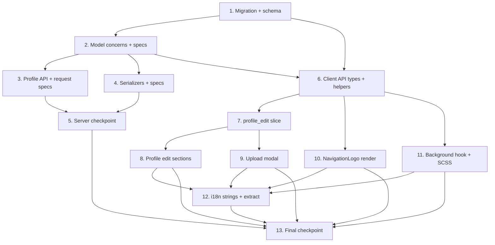

# Implementation Plan: Custom Logo and Background Image

## Overview

This plan converts the design into incremental, code-focused steps. The work flows
server-first (migration -> model concerns -> API -> serializers), then client
(types -> Redux slice -> profile-edit UI -> upload modal -> logo render -> background
render -> SCSS -> i18n). Each implementation task is paired with tests that mirror the
repository's **existing** conventions, and every step builds on the previous one so the
feature is fully wired by the end with no orphaned code.

**Implementation languages (already fixed by the design — no pseudocode):**

- **Server:** Ruby (Rails 8) — ActiveRecord, Paperclip attachments, ActiveModel::Serializer, RSpec + Fabrication.
- **Client:** TypeScript / React — Redux Toolkit slice, `@testing-library/react`, Vitest.

### Testing-framework conventions (verified against this repo)

- **JS/TS tests use Vitest** (`yarn test:js`), env `jsdom`, `globals: true`. Test files are
  colocated `*.test.ts(x)` next to source (e.g. `actions/timelines.test.ts`) or under
  `__tests__/` (e.g. `utils/__tests__/cache.test.ts`). `@testing-library/react` and
  `@testing-library/dom` are available.
- **Ruby tests use RSpec** (`bundle exec rspec`) with **Fabrication** factories
  (`Fabricate(:account, ...)`), `fixture_file_upload('avatar.gif', 'image/gif')`,
  shoulda-matchers, webmock, the shared example `it_behaves_like 'forbidden for wrong scope'`,
  and `include_context 'with API authentication'` + `let(:scopes)` for auth.
- **Existing fixtures reused for uploads:** `spec/fixtures/files/avatar.gif` (GIF path) and
  `spec/fixtures/files/attachment.jpg` (JPEG path). No new fixtures are required; if a
  metadata-stripping example needs EXIF data, add one small fixture (noted in that task).

### Property-test reconciliation (IMPORTANT — read before any `*` property task)

The design's Testing Strategy names **fast-check** (JS) and **rantly** (Ruby) for the
property-based tests. **Neither library is a dependency of this repository, and no new test
dependency may be introduced.** Instead, every Correctness Property (P1–P8) is implemented as a
**parameterized / table-driven example test using the frameworks already present**:

- **TypeScript (P2, P3, P4):** Vitest `describe.each` / `it.each` looping over the enumerated
  (and a few pseudo-random) input combinations.
- **Ruby (P1, P5, P6, P7, P8):** RSpec looping over an array/`product` of enumerated cases over
  the existing rspec + Fabrication setup.

Each property gets **one dedicated test** whose description/comment preserves traceability to the
design, e.g. `// Feature: custom-logo-and-background, Property 2: Logo render decision` (JS) or
`# Feature: custom-logo-and-background, Property 1: Enable-flag round-trip` (Ruby). This
reconciliation is restated inline in each property task below.

---

## Tasks

- [x] 1. Database migration and schema
  - [x] 1.1 Write the `AddCustomLogoAndBackgroundImageToAccounts` migration
    - Create `db/migrate/<timestamp>_add_custom_logo_and_background_image_to_accounts.rb` (`ActiveRecord::Migration[8.0]`, `def change`).
    - Add custom-logo columns: `custom_logo_file_name:string`, `custom_logo_content_type:string`, `custom_logo_file_size:integer`, `custom_logo_updated_at:datetime`, `custom_logo_description:string, null: false, default: ''`, `custom_logo_enabled:boolean, null: false, default: false`.
    - Add background-image columns: `background_image_file_name:string`, `background_image_content_type:string`, `background_image_file_size:integer`, `background_image_updated_at:datetime`, `background_image_enabled:boolean, null: false, default: false`.
    - Use plain `add_column` only (all additive); this satisfies the `strong_migrations` gem because nullable attachment columns and boolean/string columns with a constant default are non-blocking on the supported PostgreSQL versions. Do not backfill.
    - _Requirements: 1.1, 1.4, 1.5, 3.1, 3.4, 5.1, 5.4, 7.1, 7.4, 12.1, 12.2_

  - [x] 1.2 Regenerate and verify `db/schema.rb`
    - Apply the migration to produce the updated `db/schema.rb` (bumped `define(version: ...)` plus the eleven new `t.*` lines on `create_table "accounts"`).
    - Confirm the eleven columns and their null/default attributes match the migration; keep the file otherwise unchanged.
    - _Requirements: 1.4, 5.4_

- [x] 2. Account model concerns
  - [x] 2.1 Create the `Account::CustomLogo` concern
    - Add `app/models/concerns/account/custom_logo.rb` mirroring `app/models/concerns/account/avatar.rb`.
    - Define `MAX_DESCRIPTION_LENGTH = 150`, `CUSTOM_LOGO_IMAGE_MIME_TYPES = ['image/jpeg','image/png','image/gif','image/webp']`, `CUSTOM_LOGO_LIMIT = 8.megabytes`, and aspect-preserving `CUSTOM_LOGO_DIMENSIONS = [522, 132]` / `CUSTOM_LOGO_GEOMETRY` using the `>` (shrink-only) geometry flag.
    - `has_attached_file :custom_logo` with the same metadata-stripping `convert_options: { all: '+profile "!icc,*" ...' }` and `processors: [:lazy_thumbnail]`; add `validates_attachment_content_type`, `validates_attachment_size`, `remotable_attachment :custom_logo, CUSTOM_LOGO_LIMIT, suppress_errors: false`.
    - Add `validates :custom_logo_description, length: { maximum: MAX_DESCRIPTION_LENGTH }, if: -> { local? && will_save_change_to_custom_logo_description? }` and the `custom_logo_original_url` / `custom_logo_static_url` helpers (GIF -> `:static`, otherwise original).
    - _Requirements: 1.1, 1.3, 1.4, 1.5, 2.1, 2.2, 2.3, 2.4_

  - [x] 2.2 Create the `Account::BackgroundImage` concern
    - Add `app/models/concerns/account/background_image.rb` mirroring `app/models/concerns/account/header.rb` (no description column).
    - Define `BACKGROUND_IMAGE_MIME_TYPES`, `BACKGROUND_IMAGE_LIMIT = 8.megabytes`, `BACKGROUND_IMAGE_DIMENSIONS = [1920, 1080]`, `BACKGROUND_IMAGE_MAX_PIXELS`, and a `background_image_styles` class method using a `pixels:` budget (header-style).
    - `has_attached_file :background_image` with the shared metadata-stripping `convert_options`, `processors: [:lazy_thumbnail]`, attachment content-type/size validations, `remotable_attachment`, and `background_image_original_url` / `background_image_static_url` helpers.
    - _Requirements: 5.1, 5.3, 5.4, 6.1, 6.2, 6.3_

  - [x] 2.3 Include both concerns in the `Account` model
    - In `app/models/account.rb`, add `include Account::CustomLogo` and `include Account::BackgroundImage` **after** `include Attachmentable` (and after Avatar/Header) so the `before_<name>_validate` dimension/metadata hooks (`check_image_dimension`, `set_file_content_type`, `obfuscate_file_name`, `set_file_extension`) are wired and existing avatar/header behavior is untouched.
    - _Requirements: 1.1, 5.1, 12.3_

  - [x]* 2.4 Write model spec for `Account::CustomLogo`
    - Add `spec/models/concerns/account/custom_logo_spec.rb` following the existing `spec/models/concerns/account/*_spec.rb` style (`RSpec.describe Account`).
    - Assert that assigning `fixture_file_upload('avatar.gif', 'image/gif')` to `custom_logo` populates `custom_logo_file_name`/`custom_logo_content_type`/`custom_logo_file_size` (1.4); two separate `Fabricate(:account)` records store logos independently (1.2); a fresh account has `custom_logo_enabled == false` (3.4); `custom_logo_description` round-trips (1.5); a 151-char description is invalid (2.4).
    - _Requirements: 1.2, 1.4, 1.5, 2.4, 3.4_

  - [x]* 2.5 Write model spec for `Account::BackgroundImage`
    - Add `spec/models/concerns/account/background_image_spec.rb` mirroring 2.4.
    - Assert that assigning `fixture_file_upload('attachment.jpg', 'image/jpeg')` populates `background_image_file_name`/`background_image_content_type`/`background_image_file_size` (5.4); independence across two accounts (5.2); `background_image_enabled` defaults to `false` (7.4).
    - _Requirements: 5.2, 5.4, 7.4_

- [x] 3. Profile API: permitted params, delete controllers, routes, and request specs
  - [x] 3.1 Permit the new params in `Api::V1::ProfilesController`
    - In `app/controllers/api/v1/profiles_controller.rb#account_params`, add `:custom_logo`, `:custom_logo_description`, `:custom_logo_enabled`, `:background_image`, `:background_image_enabled` to the permit list.
    - Rely on the existing `rescue ActiveRecord::RecordInvalid => e` -> `ValidationErrorFormatter` (422) path; strong-params silently drop unknown keys (11.4) and omitted image keys leave stored values intact (12.4).
    - _Requirements: 11.1, 11.2, 11.4, 12.4_

  - [x] 3.2 Create `Api::V1::Profile::CustomLogosController`
    - Add `app/controllers/api/v1/profile/custom_logos_controller.rb` mirroring `avatars_controller.rb`: `doorkeeper_authorize! :write, :'write:accounts'`, `require_user!`, and `destroy` that calls `UpdateAccountService.new.call(@account, { custom_logo: nil }, raise_error: true)`, enqueues `ActivityPub::UpdateDistributionWorker.perform_in(...DEBOUNCE_DELAY, @account.id)`, and renders `REST::CredentialAccountSerializer`.
    - _Requirements: 10.5_

  - [x] 3.3 Create `Api::V1::Profile::BackgroundImagesController`
    - Add `app/controllers/api/v1/profile/background_images_controller.rb` identical in shape to 3.2 but assigning `{ background_image: nil }`.
    - _Requirements: 10.6_

  - [x] 3.4 Add the delete routes
    - In `config/routes/api.rb`, inside the existing `resource :profile ... scope module: :profile` block, add `resource :custom_logo, only: :destroy` and `resource :background_image, only: :destroy` (alongside `:avatar` / `:header`), yielding `DELETE /api/v1/profile/custom_logo` and `DELETE /api/v1/profile/background_image`.
    - _Requirements: 10.5, 10.6_

  - [x]* 3.5 Extend `spec/requests/api/v1/profiles_spec.rb` with example/edge-case specs
    - Mirror the file's existing structure 1:1. In `GET /api/v1/profile`, extend the `parsed_body` match to include `custom_logo`/`custom_logo_static` (URL-or-nil), `custom_logo_description` (`''`), `custom_logo_enabled` (`false`), `background_image`/`background_image_static`, `background_image_enabled`.
    - In `PATCH /api/v1/profile`, add the new fields to `params` (using `fixture_file_upload('avatar.gif','image/gif')` for the logo and `fixture_file_upload('attachment.jpg','image/jpeg')` for the background) and assert the reloaded account `have_attributes(...)`.
    - Add `with invalid data` cases asserting **422**: unsupported MIME for logo/background (2.1, 6.1), oversize file (2.2, 6.2), and a 151-char `custom_logo_description` (2.4), following the existing `error: /Validation failed/` style.
    - Add `DELETE /api/v1/profile/custom_logo` and `DELETE /api/v1/profile/background_image` specs mirroring the avatar/header delete specs: seed `avatar`+`header`+the target attachment, assert the target is removed while the other attachment **and** avatar/header are preserved, include `it_behaves_like 'forbidden for wrong scope', 'read'`, and assert `ActivityPub::UpdateDistributionWorker` is enqueued for `account.id`.
    - _Requirements: 2.1, 2.2, 2.4, 6.1, 6.2, 10.5, 10.6, 11.1, 11.2, 11.4, 13.3_

  - [x]* 3.6 Property test P1 (Enable-flag round-trip) in `profiles_spec.rb`
    - **Property 1: Enable-flag round-trip** — **Validates: Requirements 3.1, 3.2, 3.3, 7.1, 7.2, 7.3, 11.2, 11.3**
    - Reconciliation: rantly is unavailable; implement as a table-driven RSpec example looping over `[true,false].product([true,false])`. For each `(custom_logo_enabled, background_image_enabled)`: `PATCH /api/v1/profile` then `GET /api/v1/profile`, asserting the read-back flags equal the submitted values. Tag with `# Feature: custom-logo-and-background, Property 1: Enable-flag round-trip`.
    - _Requirements: 3.1, 3.2, 3.3, 7.1, 7.2, 7.3, 11.2, 11.3_

  - [x]* 3.7 Property test P6 (Omitted-field preservation) in `profiles_spec.rb`
    - **Property 6: Omitted-field preservation** — **Validates: Requirements 12.4**
    - Reconciliation: table-driven RSpec over several seeded stored states (logo present/absent, background present/absent, each flag true/false). For each, `PATCH` a body that omits the logo/background fields (e.g. only `display_name`), then `GET`, asserting the stored logo, background, and both enable flags are unchanged. Tag `# ... Property 6: Omitted-field preservation`.
    - _Requirements: 12.4_

  - [x]* 3.8 Property test P8 (Avatar/header independence) in `profiles_spec.rb`
    - **Property 8: Avatar/header independence** — **Validates: Requirements 13.3**
    - Reconciliation: RSpec looping over the update operations (`custom_logo`, `background_image`, `custom_logo_enabled`, `background_image_enabled`). Seed `avatar`+`header` on the account, capture their `*_file_name` and URLs, perform each update via `PATCH`, and assert the avatar/header file names and URLs are unchanged. Tag `# ... Property 8: Avatar/header independence`.
    - _Requirements: 13.3_

- [x] 4. Serialization
  - [x] 4.1 Extend `REST::ProfileSerializer`
    - In `app/serializers/rest/profile_serializer.rb`, add attributes `:custom_logo, :custom_logo_static, :custom_logo_description, :custom_logo_enabled, :background_image, :background_image_static, :background_image_enabled`.
    - Implement nil-guarded URL methods following the existing `avatar`/`header` pattern: return `full_asset_url(object.custom_logo_original_url)` when `object.custom_logo_file_name.present?` else `nil` (and likewise for `_static` and background); `custom_logo_description`/`*_enabled` are plain column reads.
    - _Requirements: 1.1, 5.1, 11.1_

  - [x] 4.2 Extend `REST::AccountSerializer` with current-user-scoped attributes
    - In `app/serializers/rest/account_serializer.rb`, add `attribute :custom_logo, if: :owned_by_current_user?` (and `_static`, `custom_logo_description`, `custom_logo_enabled`, `background_image`, `background_image_static`, `background_image_enabled`).
    - Add the matching nil-guarded URL methods and a private `owned_by_current_user?` returning `current_user.present? && current_user.account_id == object.id`. `REST::CredentialAccountSerializer` inherits these automatically.
    - _Requirements: 11.5, 13.1_

  - [x]* 4.3 Create `spec/serializers/rest/profile_serializer_spec.rb` (example tests)
    - New file using `serialized_record_json(account, described_class)`. Assert the seven new keys are present; that `custom_logo`/`background_image` are full `https://...` asset URLs when the attachment is stored and `nil` when absent; and that `custom_logo_description` defaults to `''`.
    - _Requirements: 1.1, 5.1, 11.1_

  - [x]* 4.4 Property test P7 (Stored-attachment URL presence) in `profile_serializer_spec.rb`
    - **Property 7: Stored-attachment URL presence** — **Validates: Requirements 1.1, 5.1, 11.1**
    - Reconciliation: RSpec looping over the four `(logo stored?, background stored?)` combinations (seed via `fixture_file_upload`). Assert each URL is non-null **iff** the corresponding attachment is stored, and is a full asset URL when present. Tag `# ... Property 7: Stored-attachment URL presence`.
    - _Requirements: 1.1, 5.1, 11.1_

  - [x]* 4.5 Extend `spec/serializers/rest/account_serializer_spec.rb` (privacy examples)
    - Following the existing spec (which passes `scope: current_user, scope_name: :current_user`): when the serialized account **is** the current user, assert the new keys are present; when it is a different account, assert they are absent.
    - _Requirements: 11.5, 13.1_

  - [x]* 4.6 Property test P5 (Current-user privacy scoping) in `account_serializer_spec.rb`
    - **Property 5: Current-user privacy scoping** — **Validates: Requirements 11.5, 13.1**
    - Reconciliation: RSpec looping over `(serialized account, requesting user)` pairs (owner vs non-owner, with/without stored images). Assert the five scoped keys appear **iff** the requesting user owns the serialized account. Tag `# ... Property 5: Current-user privacy scoping`.
    - _Requirements: 11.5, 13.1_

  - [x]* 4.7 Add federation-exclusion regression spec
    - In `spec/serializers/activitypub/actor_serializer_spec.rb`, seed an account with a stored `custom_logo` and `background_image` and assert the serialized actor JSON contains **no** `custom_logo*` or `background_image*` keys (no production change to `ActivityPub::ActorSerializer`).
    - _Requirements: 13.2_

- [x] 5. Checkpoint - server layer
  - Ensure all server tests (model concern specs, profile request specs incl. properties, serializer specs) pass, ask the user if questions arise.

- [x] 6. Client API types and request helpers
  - [x] 6.1 Extend profile API types
    - In `app/javascript/mastodon/api_types/profile.ts`, add to `ApiProfileJSON`: `custom_logo: string | null`, `custom_logo_static: string | null`, `custom_logo_description: string`, `custom_logo_enabled: boolean`, `background_image: string | null`, `background_image_static: string | null`, `background_image_enabled: boolean`.
    - Add `'custom_logo_description' | 'custom_logo_enabled' | 'background_image_enabled'` to the `ApiProfileUpdateParams` `Pick`.
    - _Requirements: 11.1, 11.2_

  - [x] 6.2 Extend account API types with owner-only optional fields
    - In `app/javascript/mastodon/api_types/accounts.ts`, add the same seven fields to `BaseApiAccountJSON` as **optional** (`custom_logo?: string | null;` ...), because non-owners never receive them.
    - _Requirements: 11.5_

  - [x] 6.3 Add defaults to the Immutable `Account` model
    - In `app/javascript/mastodon/models/account.ts`, add matching entries to `accountDefaultValues` (e.g. `custom_logo: '', custom_logo_static: '', custom_logo_description: '', custom_logo_enabled: false, background_image: '', background_image_static: '', background_image_enabled: false`) so pre-existing accounts behave as before.
    - _Requirements: 12.1, 12.2_

  - [x] 6.4 Add the delete request helpers
    - In `app/javascript/mastodon/api/accounts.ts`, add `apiDeleteProfileCustomLogo = () => apiRequestDelete('v1/profile/custom_logo')` and `apiDeleteProfileBackgroundImage = () => apiRequestDelete('v1/profile/background_image')`.
    - _Requirements: 10.5, 10.6_

- [x] 7. Redux `profile_edit` slice
  - [x] 7.1 Widen `ImageLocation` and extend `transformProfile`
    - In `app/javascript/mastodon/reducers/slices/profile_edit.ts`, change `ImageLocation` to `'avatar' | 'header' | 'custom_logo' | 'background_image'` and map the new fields into camelCase `ProfileData` inside `transformProfile` (`customLogo`, `customLogoStatic`, `customLogoDescription`, `customLogoEnabled`, `backgroundImage`, `backgroundImageStatic`, `backgroundImageEnabled`). `selectImageInfo` and `uploadImage` work unchanged once the keys exist.
    - _Requirements: 9.7, 9.8, 11.1_

  - [x] 7.2 Extend the `deleteImage` thunk
    - In the same file, replace the `avatar`/`header` `if/else` with a `switch (arg.location)` that calls `apiDeleteProfileCustomLogo()` for `'custom_logo'` and `apiDeleteProfileBackgroundImage()` for `'background_image'`.
    - _Requirements: 10.5, 10.6_

  - [x]* 7.3 Write `reducers/slices/profile_edit.test.ts` (colocated Vitest)
    - Assert `transformProfile` maps the new snake_case API fields to the camelCase `ProfileData` keys, and that `selectImageInfo` returns `{ src, static, alt }` for `'custom_logo'` and `{ src, static, alt: undefined }` for `'background_image'` (no description). Follow the `describe`/`test` style of `actions/timelines.test.ts`.
    - _Requirements: 9.7, 9.8, 11.1_

- [x] 8. Profile edit page sections
  - [x] 8.1 Add the Custom Logo and Background Image sections
    - In `app/javascript/mastodon/features/account_edit/index.tsx`, add two `AccountEditSection` blocks (after the existing sections) each pairing `<AccountImageEdit location='custom_logo' />` / `location='background_image'` with a `ToggleField`, a stored-image `` preview, and `defineMessages` entries for titles/placeholders.
    - Add `handleCustomLogoToggle` / `handleBackgroundImageToggle` `useCallback`s dispatching `patchProfile({ custom_logo_enabled: !profile.customLogoEnabled })` / `patchProfile({ background_image_enabled: !profile.backgroundImageEnabled })`; wire `disabled={isPending}`.
    - _Requirements: 9.1, 9.2, 9.3, 9.4, 9.5, 9.6, 9.7, 9.8_

  - [x] 8.2 Add preview styles
    - In `app/javascript/mastodon/features/account_edit/styles.module.scss`, add `customLogoPreview` / `backgroundImagePreview` classes used by the section previews (constrained dimensions consistent with existing section imagery).
    - _Requirements: 9.7, 9.8_

  - [x]* 8.3 Write `features/account_edit/index.test.tsx` (Vitest + `@testing-library/react`)
    - Render the page with a mocked store; assert both new `AccountEditSection`s render with an `AccountImageEdit` control and a `ToggleField`; toggling dispatches `patchProfile` with the correct flag; a stored `customLogo`/`backgroundImage` renders a preview ``.
    - _Requirements: 9.1, 9.2, 9.3, 9.4, 9.5, 9.6, 9.7, 9.8_

- [x] 9. Image upload modal (crop aspect and per-location copy)
  - [x] 9.1 Add per-location crop aspect
    - In `app/javascript/mastodon/features/account_edit/modals/image_upload.tsx`, replace the `aspect={location === 'avatar' ? 1 : 3 / 1}` in `StepCrop` with a `CROP_ASPECT: Record<ImageLocation, number>` lookup (`avatar: 1, header: 3/1, custom_logo: 261/66, background_image: 16/9`).
    - _Requirements: 10.2_

  - [x] 9.2 Add per-location modal copy and suppress alt for background
    - In the same file, add `custom_logo`/`background_image` entries to the `messages` map (`${location}Add` / `${location}Replace`) and to the `StepUpload` size-hint `width`/`height` values; suppress the alt step/tip for `background_image` (it has no description), consistent with how `header` hides the alt tip.
    - _Requirements: 10.1, 10.3_

  - [x]* 9.3 Write `modals/image_upload.test.tsx` (Vitest + `@testing-library/react`)
    - Assert selecting a PNG advances to the crop step using the location's aspect ratio; selecting a GIF skips crop and goes straight to alt (and background skips alt entirely); confirming a replacement uploads only the most recently selected blob (10.4).
    - _Requirements: 10.1, 10.2, 10.3, 10.4_

- [x] 10. Custom logo rendering
  - [x] 10.1 Create the `NavigationLogo` component
    - Add `app/javascript/mastodon/features/navigation_panel/components/navigation_logo.tsx`. Use `useAccount(me)`; render a custom `` (src `autoPlayGif ? custom_logo : custom_logo_static`, `alt = custom_logo_description || 'Mastodon'`, class `logo logo--custom`) **iff** `custom_logo_enabled && custom_logo`; otherwise render `<WordmarkLogo />`.
    - _Requirements: 4.1, 4.2, 4.3, 4.5, 12.1_

  - [x] 10.2 Wire `NavigationLogo` into the navigation panel
    - In `app/javascript/mastodon/features/navigation_panel/index.tsx`, replace `<WordmarkLogo />` inside `.navigation-panel__logo` with `<NavigationLogo />`, keeping the surrounding `<Link to='/' className='column-link column-link--logo' id={getNavigationSkipLinkId()}>` so the home-route link target is preserved.
    - _Requirements: 4.4_

  - [x]* 10.3 Property test P2 (Logo render decision) in `navigation_logo.test.tsx`
    - **Property 2: Logo render decision** — **Validates: Requirements 4.1, 4.2, 4.3, 12.1**
    - Reconciliation: fast-check is unavailable; implement with Vitest `describe.each` over the four `(custom_logo_enabled in {true,false}) x (custom_logo in {url,''})` combinations (plus a couple of pseudo-random URL strings). Render `NavigationLogo` via `@testing-library/react` and assert the custom `` renders **iff** enabled && url, else `WordmarkLogo`. Tag `// Feature: custom-logo-and-background, Property 2: Logo render decision`.
    - _Requirements: 4.1, 4.2, 4.3, 12.1_

  - [x]* 10.4 Property test P3 (Logo alternative-text default) in `navigation_logo.test.tsx`
    - **Property 3: Logo alternative-text default** — **Validates: Requirements 4.5**
    - Reconciliation: Vitest `it.each` over description strings including non-empty, empty `''`, and whitespace-only values. With the logo rendered, assert the accessible name equals the stored description when non-empty and `'Mastodon'` otherwise. Tag `// ... Property 3: Logo alternative-text default`.
    - _Requirements: 4.5_

  - [x]* 10.5 Logo link-target test in `features/navigation_panel/index.test.tsx`
    - Render `NavigationPanel` with the custom logo enabled and disabled; assert the logo link still targets `/` in both cases (4.4).
    - _Requirements: 4.4_

- [x] 11. Background image rendering
  - [x] 11.1 Add the `useBackgroundImage` hook and mount it
    - Add the `useBackgroundImage` hook (new helper, e.g. `features/ui/hooks/useBackgroundImage.ts` or inline) and call it from `app/javascript/mastodon/features/ui/index.jsx` alongside the existing `document.body.classList.toggle('layout-single-column', ...)` logic.
    - The hook reads `useAccount(me)`; when `background_image_enabled && background_image`, it sets `body.style.setProperty('--custom-background-image', 'url("' + CSS.escape(url) + '")')` and adds the `custom-background` body class; otherwise it removes both; clean up on unmount.
    - _Requirements: 8.1, 8.5, 8.6, 13.1_

  - [x] 11.2 Add the background SCSS rule
    - In `app/javascript/styles/mastodon/basics.scss`, add a `@media screen and (min-width: 890px) { body.custom-background::before { ... } }` rule with `z-index: -1; content: ''; filter: brightness(0.15); background: var(--custom-background-image) top / cover no-repeat fixed; width: 100%; height: 100%; position: fixed; inset: 0; }`. The `::before` pseudo-element is decorative and outside the accessibility tree (8.7); the literal `890px` is used since no shared variable maps to it.
    - _Requirements: 8.1, 8.2, 8.3, 8.4, 8.7_

  - [x]* 11.3 Property test P4 (Background activation decision) in `useBackgroundImage.test.tsx`
    - **Property 4: Background activation decision** — **Validates: Requirements 8.1, 8.5, 8.6, 12.2**
    - Reconciliation: fast-check is unavailable; implement with Vitest `describe.each` over `(background_image_enabled in {true,false}) x (background_image in {url,''})` (plus a couple of pseudo-random URLs). Render the hook (via a test component / `renderHook`) and assert `document.body.classList.contains('custom-background')` and the `--custom-background-image` property are set **iff** enabled && url, and removed otherwise. Tag `// ... Property 4: Background activation decision`.
    - _Requirements: 8.1, 8.5, 8.6, 12.2_

- [x] 12. Internationalization
  - [x] 12.1 Add new message strings to `en.json`
    - In `app/javascript/mastodon/locales/en.json`, add the `account_edit.custom_logo.*` and `account_edit.background_image.*` keys (section titles, placeholders, `enable_label`) plus `account_edit.upload_modal.title_add.custom_logo` / `title_replace.custom_logo` / `title_add.background_image` / `title_replace.background_image`, matching the `defineMessages` ids introduced in tasks 8.1 and 9.2.
    - _Requirements: 9.1, 9.2, 9.4, 9.6, 10.1_

  - [x] 12.2 Synchronize extracted default messages
    - Run `yarn i18n:extract` (formatjs extraction) so the new `defineMessages`/`FormattedMessage` defaults are reflected in `en.json`; verify no other locale defaults regress and the build's i18n check passes.
    - _Requirements: 9.1, 9.2, 9.4, 9.6, 10.1_

- [x] 13. Final checkpoint - full feature wiring
  - Ensure the entire feature is wired end-to-end (migration -> concerns -> API/serializers -> client types -> slice -> profile-edit sections -> upload modal -> logo render -> background render -> SCSS -> i18n) and all Ruby (RSpec) and JS (Vitest) tests pass. Ask the user if questions arise.

## Notes

- Tasks marked with `*` are optional test sub-tasks and can be skipped for a faster MVP; core implementation tasks are never optional.
- Each task references the specific requirement clauses (and, for property tests, the design Correctness Property number) it implements, for traceability.
- **No new test dependencies are introduced.** Property-based tests (P1–P8) are implemented as parameterized/table-driven example tests using the repo's existing RSpec (P1, P5, P6, P7, P8) and Vitest (P2, P3, P4) setups, with a `Property N` comment preserving the link to `design.md`.
- Server tests mirror `spec/requests/api/v1/profiles_spec.rb`, `spec/serializers/rest/account_serializer_spec.rb`, and `spec/models/concerns/account/*_spec.rb`; client tests follow the colocated Vitest convention seen in `actions/timelines.test.ts` and `utils/__tests__/cache.test.ts`.
- Upload tests reuse existing fixtures `spec/fixtures/files/avatar.gif` (GIF/static path) and `spec/fixtures/files/attachment.jpg` (JPEG path). A small EXIF-bearing fixture may be added only if a metadata-stripping example (Req 1.3 / 5.3) is exercised directly; that integration check is otherwise covered by the shared `convert_options` pipeline.
- Checkpoints (tasks 5 and 13) validate incrementally: once after the server layer and once at full wiring.

## Task Dependency Graph

The graph below shows the high-level epic ordering (server-first, then client, with tests
depending on their implementation). The authoritative parallel-execution schedule is the JSON
waves block that follows.



```json
{
  "waves": [
    { "id": 0, "tasks": ["1.1", "6.1", "6.2", "6.4", "8.2", "11.2", "12.1"] },
    { "id": 1, "tasks": ["1.2", "6.3", "7.1"] },
    { "id": 2, "tasks": ["2.1", "2.2", "7.2", "8.1", "9.1", "10.1", "11.1"] },
    { "id": 3, "tasks": ["2.3", "7.3", "8.3", "9.2", "10.2", "10.3", "11.3"] },
    { "id": 4, "tasks": ["3.1", "3.2", "3.3", "4.1", "4.2", "2.4", "2.5", "9.3", "10.4", "10.5", "12.2"] },
    { "id": 5, "tasks": ["3.4", "4.3", "4.5", "4.7"] },
    { "id": 6, "tasks": ["3.5", "4.4", "4.6"] },
    { "id": 7, "tasks": ["3.6"] },
    { "id": 8, "tasks": ["3.7"] },
    { "id": 9, "tasks": ["3.8"] }
  ]
}
```
